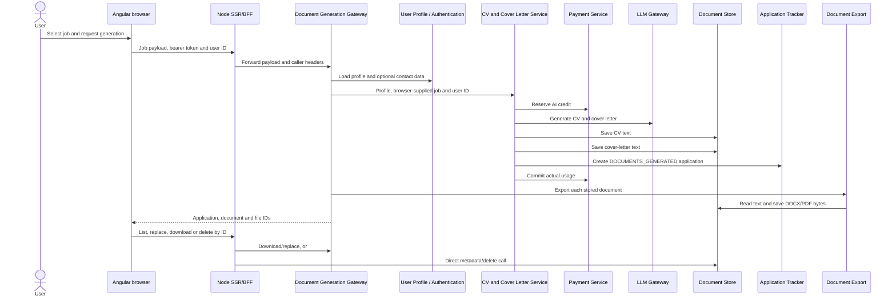

# ADR 0001: Document architecture and ownership

- Status: Accepted as the beta implementation boundary; implementation remains incomplete
- Date: 2026-07-24
- Decision owner: Documents and AI workstream
- Source issue: [DOC-01](https://github.com/jobseekercopilot/document-store-service/issues/7)
- Related architecture issue: [DOCGEN-01](https://github.com/jobseekercopilot/document-generation-gateway/issues/4)

## Context

The document journey crosses the browser client, Document Generation Gateway,
CV and Cover Letter Service, Document Store, Document Export, Application
Tracker, Payment Service, LLM Gateway, User Profile, Authentication and Job
Service. The current code has useful happy-path behavior, but its state,
identity and failure boundaries do not yet form a safe beta architecture.

This decision records:

- the current source-backed flow;
- the authoritative owner for each piece of state;
- the required trust and authorization decisions;
- the functional readiness classification;
- the dependency order and executable test evidence needed before enablement.

It does not implement the linked security, persistence, lifecycle, generation,
export or client issues. It also does not select a production database, object
store, asynchronous transport or cloud provider.

## Evidence baseline

The decision was checked against these `develop` revisions:

| Repository | Revision | Primary evidence |
| --- | --- | --- |
| `document-store-service` | `cf0c06aa57897a31a06df4b37e5e819a5ce2f96c` | controllers, entities, repositories, services, OpenAPI and beta audit |
| `document-export-service` | `616bdd70e6418fc2b985c72deb5a14df6912304a` | export/upload controller, render services, store client and beta audit |
| `document-generation-gateway` | `0f77337881062990a8178245d1e99b015ae79d10` | security filter, generation/replacement/download orchestration, OpenAPI and beta audit |
| `cv-cover-letter-service` | `8ad626268616c218d64144df6abdceab34602479` | generation, billing, document/application writes, prompt resources and beta audit |
| `application-tracker-service` | `d9e6bc9fcbe4ef665334c58672c8062b1e4796aa` | owner resolver, security matrix, application state, OpenAPI and beta audit |
| `job-seeker-copilot-client` | `deb64cb316c35e090b8cca039a367250b46b0b4b` | SSR/BFF proxies, document/application workspaces and feature gates |
| `infrastructure` | `bd8f575246178dba867ea0ab980e02b97bbf087f` | base and E2E Compose topology |

The repository-specific beta audits remain the detailed finding registers.
This ADR resolves their cross-repository ownership question; it does not
supersede their blockers.

## Current flow

The document capabilities are disabled in the selected client beta
configuration. If enabled, the current path is:

### Current-state observations

- `DocumentGenerationController` and `JwtTokenFilter` accept `X-User-Id` as a
  fallback identity. The BFF forwards that browser header.
- The gateway accepts the browser's job body and does not load the configured
  Job Service client before generation.
- `CvCoverLetterService` performs billing, two document writes and application
  creation in one synchronous call. There is no durable operation or
  idempotency key.
- The two initial `GeneratedDocument` rows are created before the application
  exists, so they have no authoritative application link.
- Document Store accepts body/path user IDs and raw document/file/application
  IDs without authentication or owner-scoped repository queries.
- Application Tracker now enforces validated user or least-privilege service
  identity and owner scope. CV and Cover Letter Service and Document Generation
  Gateway do not yet inject its producer credential and owner context.
- Base Compose does not inject the Application Tracker producer/reader
  credentials and contains a literal development JWT secret for Document
  Generation Gateway. This is already owned by
  [APP-03](https://github.com/jobseekercopilot/application-tracker-service/issues/4)
  and [INFRA-08](https://github.com/jobseekercopilot/infrastructure/issues/9).
- Document Export stores an uploaded DOCX but renders the replacement PDF from
  the older stored text. The response can therefore claim that the PDF contains
  edits which are not present.
- Replacement activates the new Document Store version before updating
  Application Tracker. Withdrawal can delete an application after a
  best-effort document deactivation failure.
- The client derives its document list from application records, then queries
  Document Store metadata directly through the BFF. These proxy routes have no
  independent owner check at Document Store.

## Decision

### Systems of record

| Concern | Authoritative owner | Required rule |
| --- | --- | --- |
| Human user identity | Authentication Service access-token subject | Browser headers, paths and bodies never select the owner |
| Browser session | The approved same-origin BFF/session boundary | No document bearer credential or owner identifier is stored in browser storage |
| Canonical job | Job Service | Generation resolves a versioned canonical job snapshot; the browser does not author employer, description or source facts |
| Profile input | User Profile Service | Only a documented allowlist is copied into a versioned generation snapshot |
| Generation operation | Document Generation Gateway | Owns operation ID, idempotency, state, timeout/retry budget and failure/reconciliation status |
| Prompt, response schema and claim provenance | CV and Cover Letter Service | Produces bounded drafts and evidence metadata; it does not own application, document, billing or export state |
| AI usage and money/credit state | Payment Service | Reservation, commit and release are idempotent and keyed to the generation operation |
| Document content, type, title, owner, lifecycle and version metadata | Document Store | Every document version is immutable after approval; state changes create auditable transitions |
| Binary metadata and bytes | Document Store | Metadata remains relational; bytes use the approved encrypted binary-storage boundary rather than an unbounded database BLOB |
| DOCX/PDF transformation | Document Export | Stateless/bounded transformation only; it is not a system of record |
| Application and its exact submitted document references | Application Tracker | Stores immutable owner-scoped document-version IDs used by the application |
| Presentation, preview and explicit approval | Client | Presents server state but is never authoritative for identity, ownership, lifecycle or version |

### Document lifecycle

The beta lifecycle uses distinct concepts:

1. `DRAFT`: generated output awaiting review; not an application and not an
   application-used version.
2. `APPROVED`: the user has explicitly accepted the document version.
3. `CURRENT`: the approved version selected for future use for its owner and
   document type.
4. `APPLICATION_USED`: an immutable reference from an Application Tracker
   record to the exact approved version used for that application.
5. `ARCHIVED` and `PENDING_PURGE`: recoverable lifecycle states governed by the
   retention decision.
6. `PURGED`: irreversible removal after authorization, retention and backup
   policy permit it.

`active` alone is not a sufficient lifecycle. Replacing or regenerating a
document creates a new version; it never mutates an application-used version.
The same document version may be both `CURRENT` and `APPLICATION_USED`, but
changing `CURRENT` must not change historical application references.

### Trust and authorization boundaries

1. The browser calls only the same-origin BFF. The document capability must
   adopt the approved HttpOnly session/CSRF boundary before it is enabled.
2. The BFF never forwards or manufactures browser-provided `X-User-Id`,
   `X-Application-Owner` or service-token headers.
3. Document Generation Gateway validates the platform access token with the
   approved asymmetric JWKS, issuer, audience, expiry, token type and subject
   rules. A symmetric shared secret and identity-header fallback are not beta
   boundaries.
4. The gateway resolves the canonical job and profile for that subject, creates
   the generation operation, and supplies only minimal versioned snapshots to
   downstream processors.
5. Backend calls authenticate with a least-privilege workload identity. Where
   a service acts for a user, owner context is derived from the validated
   subject and bound to that authenticated service request.
6. Application Tracker continues to enforce its producer/reader/user matrix
   and `X-Application-Owner` rule. Consumers and Infrastructure must complete
   the rollout tracked by APP-03.
7. Document Store independently authenticates every caller and applies an
   owner predicate to create, list, read, export, upload, download, version,
   activate, archive and purge operations. A UUID is never authority.
8. Document Export accepts only an authorized, owner-bound render command and
   cannot use a raw document ID to bypass Store ownership.
9. Application Tracker validates that referenced document versions belong to
   the application owner and are eligible for application use.
10. Denials are non-enumerating. Logs, metrics and traces exclude document
    content, personal filenames, tokens and raw owner/document/application IDs.

### Approved orchestration shape

- Draft generation and actual model-usage billing may complete before user
  approval, because model cost has already been incurred.
- CV and Cover Letter Service returns a bounded draft plus provenance to the
  gateway. It does not create Application Tracker rows or write Document Store
  state directly.
- The gateway coordinates draft persistence, explicit approval, export and
  application linking through one durable idempotent operation.
- Application creation happens only after explicit approval and references the
  exact approved CV and cover-letter version IDs.
- Multi-resource steps are not treated as a distributed database transaction.
  Each step is idempotent, records its outcome, and has an explicit
  compensation or reconciliation rule.
- Document Export renders from the authoritative content of the exact requested
  version. A user-uploaded DOCX becomes the source for its regenerated PDF or
  the operation fails without changing the current version.

## Functional readiness

`Working` means the current source has a tested narrow happy path. It does not
mean beta-ready.

| Capability | Classification | Evidence and required owner |
| --- | --- | --- |
| Generated text creation | Incomplete | CV and cover-letter text can be saved, but before approval and without atomic application linkage. [CVCL-01](https://github.com/jobseekercopilot/cv-cover-letter-service/issues/9) |
| User upload | Incomplete | DOCX extension/MIME/basic ZIP checks exist; content safety, size expansion and authorization are incomplete. [DOC-05](https://github.com/jobseekercopilot/document-store-service/issues/11), [EXPORT-02](https://github.com/jobseekercopilot/document-export-service/issues/4) |
| Generation storage | Incomplete | Two independent writes can leave one document or orphan both. [DOC-08](https://github.com/jobseekercopilot/document-store-service/issues/13), [DOCGEN-09](https://github.com/jobseekercopilot/document-generation-gateway/issues/7) |
| List | Incomplete | Store can list by supplied user/job; client lists through applications and direct metadata proxies. Neither Store path is owner-authorized. [DOC-04](https://github.com/jobseekercopilot/document-store-service/issues/10), [DOCGEN-16](https://github.com/jobseekercopilot/job-seeker-copilot-client/issues/32) |
| Metadata/content retrieval | Working, unsafe | Raw UUID retrieval works without Store authentication. [STORE-01](https://github.com/jobseekercopilot/document-store-service/issues/2) |
| Download | Working, unsafe | Active bytes are returned by file UUID; gateway authentication does not prove file ownership. [GW-01](https://github.com/jobseekercopilot/document-generation-gateway/issues/12), [DOC-04](https://github.com/jobseekercopilot/document-store-service/issues/10) |
| DOCX/PDF export | Working, incomplete | Both renderers and Store writes have happy-path tests; atomicity, bounded rendering, accessibility and format fidelity remain open. [DOC-07](https://github.com/jobseekercopilot/document-export-service/issues/6), [EXPORT-02](https://github.com/jobseekercopilot/document-export-service/issues/4), [EXPORT-03](https://github.com/jobseekercopilot/document-export-service/issues/5) |
| Replacement | Incorrect | Uploaded DOCX edits are not the source of the advertised replacement PDF, and cross-service activation is non-atomic. [EXPORT-01](https://github.com/jobseekercopilot/document-export-service/issues/3), [STORE-03](https://github.com/jobseekercopilot/document-store-service/issues/4) |
| Naming | Incomplete | Generated names are slugged, but uploaded names are trusted and safe display/download naming is not a governed contract. [DOC-05](https://github.com/jobseekercopilot/document-store-service/issues/11) |
| Application linking | Incomplete | Application Tracker owns CV/cover-letter IDs, but initial Store rows lack the application ID and references are not validated across owners. [DOC-06](https://github.com/jobseekercopilot/document-store-service/issues/12), [DOCGEN-17](https://github.com/jobseekercopilot/document-generation-gateway/issues/8) |
| Versioning/current selection | Incomplete | `max(version)+1` and activation are concurrency-unsafe; no immutable application-used semantic exists. [STORE-03](https://github.com/jobseekercopilot/document-store-service/issues/4), [DOC-06](https://github.com/jobseekercopilot/document-store-service/issues/12) |
| Lifecycle/delete/retention | Absent for beta | Delete/deactivate exists without archive, retention, recovery, audit or protected-history rules. [DOC-09](https://github.com/jobseekercopilot/document-store-service/issues/14) |
| Retry/idempotency | Absent | Duplicate generation/export/upload can create duplicate or partial state. [DOCGEN-09](https://github.com/jobseekercopilot/document-generation-gateway/issues/7), [DOC-08](https://github.com/jobseekercopilot/document-store-service/issues/13) |
| Partial-failure recovery | Absent | No durable operation or reconciliation state spans billing, Store, Tracker and Export. [DOC-08](https://github.com/jobseekercopilot/document-store-service/issues/13), [APP-08](https://github.com/jobseekercopilot/application-tracker-service/issues/9) |
| Large content/files | Incomplete | Multipart limits exist, but base64, expanded archive, text, page, memory and response limits are not end-to-end. [DOC-05](https://github.com/jobseekercopilot/document-store-service/issues/11), [EXPORT-02](https://github.com/jobseekercopilot/document-export-service/issues/4) |
| Unsupported/corrupt types | Incomplete | PDF upload is inconsistently exposed; PDF signatures and hostile DOCX features are not safely rejected. [DOC-05](https://github.com/jobseekercopilot/document-store-service/issues/11) |
| Browser preview/edit/approval | Absent for beta | Document UI code exists but is feature-gated off and has no approved end-to-end review gate. [DOCGEN-16](https://github.com/jobseekercopilot/job-seeker-copilot-client/issues/32) |
| Accessible template choice | Deferred | Useful post-blocker product improvement already tracked as [BACKLOG-DOCS-01](https://github.com/jobseekercopilot/document-export-service/issues/1). |

## Dependency order

1. Make all participating builds and contracts reproducible:
   [DOC-02](https://github.com/jobseekercopilot/document-store-service/issues/8),
   [DOCGEN-02](https://github.com/jobseekercopilot/document-generation-gateway/issues/5)
   and [DOCGEN-03](https://github.com/jobseekercopilot/document-generation-gateway/issues/6).
2. Establish trusted identities and secret injection:
   [GW-01](https://github.com/jobseekercopilot/document-generation-gateway/issues/12),
   [STORE-01](https://github.com/jobseekercopilot/document-store-service/issues/2),
   [DOC-04](https://github.com/jobseekercopilot/document-store-service/issues/10),
   [APP-03](https://github.com/jobseekercopilot/application-tracker-service/issues/4),
   [CVCL-02](https://github.com/jobseekercopilot/cv-cover-letter-service/issues/10)
   and [INFRA-08](https://github.com/jobseekercopilot/infrastructure/issues/9).
3. Apply this state/ownership split through
   [DOCGEN-01](https://github.com/jobseekercopilot/document-generation-gateway/issues/4),
   [CVCL-01](https://github.com/jobseekercopilot/cv-cover-letter-service/issues/9),
   [GW-02](https://github.com/jobseekercopilot/document-generation-gateway/issues/13)
   and [DOCGEN-17](https://github.com/jobseekercopilot/document-generation-gateway/issues/8).
4. Establish durable encrypted metadata/binary persistence with migrations:
   [DOC-03](https://github.com/jobseekercopilot/document-store-service/issues/9)
   and [STORE-02](https://github.com/jobseekercopilot/document-store-service/issues/3).
5. Implement immutable versions, safe current selection, application links,
   idempotency and reconciliation:
   [DOC-06](https://github.com/jobseekercopilot/document-store-service/issues/12),
   [STORE-03](https://github.com/jobseekercopilot/document-store-service/issues/4),
   [DOC-08](https://github.com/jobseekercopilot/document-store-service/issues/13)
   and [DOCGEN-09](https://github.com/jobseekercopilot/document-generation-gateway/issues/7).
6. Harden upload/export semantics through
   [DOC-05](https://github.com/jobseekercopilot/document-store-service/issues/11),
   [DOC-07](https://github.com/jobseekercopilot/document-export-service/issues/6)
   and [EXPORT-01](https://github.com/jobseekercopilot/document-export-service/issues/3).
7. Complete lifecycle, operations and security evidence:
   [DOC-09](https://github.com/jobseekercopilot/document-store-service/issues/14),
   [DOC-10](https://github.com/jobseekercopilot/document-store-service/issues/15)
   and [DOC-11](https://github.com/jobseekercopilot/document-store-service/issues/16).
8. Enable only after the explicit-approval client journey and browser suite pass:
   [DOCGEN-16](https://github.com/jobseekercopilot/job-seeker-copilot-client/issues/32),
   [DOC-12](https://github.com/jobseekercopilot/e2e/issues/16)
   and [DOCGEN-23](https://github.com/jobseekercopilot/document-generation-gateway/issues/11).

## Executable test matrix

Each row names the durable issue which owns executable evidence. DOC-01 is not
complete evidence for those implementations.

| Scenario | Required assertion | Evidence owner |
| --- | --- | --- |
| Missing/invalid/expired user session | Every browser-facing document operation fails closed without disclosing resource existence | GW-01, STORE-01, DOC-04 |
| Foreign document/application/file IDs | Read, list, render, upload, download, replace, delete and link all return the same non-enumerating denial as a missing ID | DOC-04, APP-03 |
| Service confused deputy | Forged owner headers and browser-supplied service headers cannot select another owner | APP-03, CVCL-02, INFRA-08 |
| Canonical input snapshot | Browser-altered job/profile fields do not override server-owned snapshots; snapshot versions are persisted | GW-02, DOCGEN-17 |
| Generate and preview | One idempotent operation yields bounded drafts without creating an application before approval | CVCL-01, DOCGEN-09, DOCGEN-16 |
| Explicit approval | Approval persists immutable CV/cover-letter versions, exports them and creates one owner-scoped application with exact IDs | DOCGEN-16, DOCGEN-17, DOC-12 |
| Duplicate click/retry | The same idempotency key produces one billing result, one approved version set and one application | DOCGEN-09, DOC-08 |
| Failure at each downstream step | Reservation, LLM, first/second save, export, application link and billing failures expose recoverable state and safe retry | DOC-08, APP-08 |
| Replacement from edited DOCX | Regenerated PDF contains the uploaded edits; old application-used versions remain unchanged | EXPORT-01, DOC-06 |
| Concurrent replace/activate | No duplicate version number or unintended multiple current versions; conflicts are deterministic | STORE-03 |
| Archive/delete/retention | Protected application-used versions survive inappropriate purge; authorized archive, restore and purge are idempotent/audited | DOC-09 |
| Restart/backup/restore | Metadata, bytes, versions and links survive restart and a tested restore with checksum integrity | DOC-03, STORE-02 |
| Hostile/oversized upload | Spoofed MIME, corrupt PDF/DOCX, macros, external relationships, archive bombs and limit violations fail before state mutation | DOC-05, EXPORT-02 |
| Format quality/accessibility | Synthetic documents preserve required text, links, metadata and extraction semantics across supported formats | DOC-07, EXPORT-02, EXPORT-03 |
| Full browser journey | Authenticated generate, preview, approve, list, download, replace and historical application reference pass with isolated fixtures and negative cross-user cases | DOC-12, DOCGEN-23 |

## Consequences

- Document Store becomes the only document/version/binary system of record.
- Application Tracker remains the only application and application-used
  reference system of record.
- CV and Cover Letter Service loses direct persistence, application and billing
  orchestration responsibilities.
- Document Export remains stateless and cannot claim success until the exact
  rendered version is durably recorded.
- The client document code remains disabled until the authorization, lifecycle
  and E2E gates pass.
- Existing focused issues remain the implementation owners. No new duplicate
  implementation issue is created by this decision.

